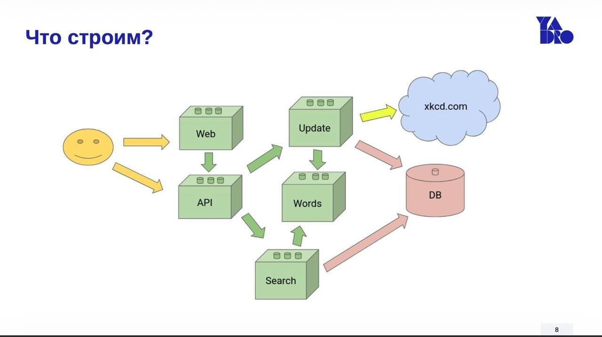
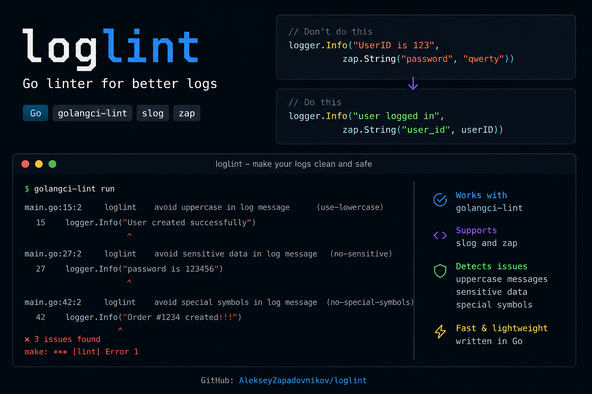

  
  
  

  
  

---

## 👨‍💻 About me

I'm Aleks — a beginner but ambitious **Golang Backend Developer** focused on building reliable, clean and scalable backend systems.

<table>
  <tr>
    <td>🚀</td>
    <td>I’m currently growing as a backend developer with a strong focus on <b>Go</b>.</td>
  </tr>
  <tr>
    <td>🧠</td>
    <td>I’m interested in backend architecture, databases, concurrency and distributed systems.</td>
  </tr>
  <tr>
    <td>🛠</td>
    <td>I enjoy building practical projects with APIs, PostgreSQL, Redis, Docker and message brokers.</td>
  </tr>
  <tr>
    <td>🎓</td>
    <td>I study at <b>ITMO University</b> and improve my skills through WB Tech School and YADRO practical courses.</td>
  </tr>
  <tr>
    <td>💙</td>
    <td>My goal is to become a strong backend engineer and create useful, reliable software.</td>
  </tr>
</table>

---

## 🚀 What I'm doing now

- 🌱 Learning backend development with **Go**
- 🎓 Studying at **ITMO University**
- 🧠 Improving through **WB Tech School** and **YADRO practical courses**
- 🛠 Building pet projects with APIs, databases, queues, cache and Docker
- 📚 Exploring system design, networking, concurrency and clean architecture

---

## 🎓 Education & Courses

  
  
  

---

## 🧰 Tech Stack

### Core Backend Stack

### Hands-on Experience

  

  
  
  
  

---

## 🏗 Featured Projects

<table>
  <tr>
    <td width="50%">
      <h3 align="center">🔎 xkcdSS</h3>
      

        
      

      

        A comic book search system for the 
        <a href="https://xkcd.com/" target="_blank">xkcd</a> 
        website, developed in Go using a microservices architecture.
      

    </td>
    <td width="50%">
      <h3 align="center">🧹 loglint</h3>
      

        
      

      

        Go linter compatible with golangci-lint that checks slog and zap log messages for style rules and possible sensitive data.
      

    </td>
  </tr>
</table>

---

## 📊 GitHub Analytics

---

## 🤝 Connect with me

---

### 💙 Thanks for visiting my profile

